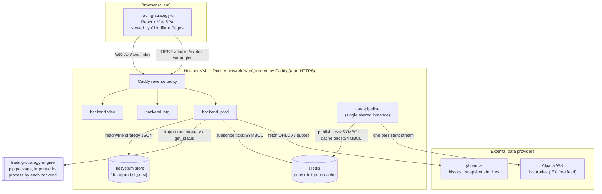

# Trading Strategy Platform — Architecture & Infrastructure

> **This is the single source of truth for the *overall* system.** Each sub-repo
> documents *its own* internals in its own `AI_CONTEXT.md` (linked below). This
> file owns the cross-cutting view: how the pieces connect, where they deploy,
> and the current state of every repo.
>
> **AI agents:** read [`AI_ONBOARDING.md`](AI_ONBOARDING.md) first — it tells you
> the read-order, how to recompute "what's the latest branch" from live git, and
> the protocol for keeping these docs current.
>
> **Last synced to git:** 2026-06-13 (see [Live state dashboard](#live-state-dashboard) — always re-verify with the one-liner there).

---

## 1. What this platform is

A trading-strategy dashboard. A user picks a ticker, sees candlestick + volume
charts with technical indicators, watches live prices stream in, and creates /
runs trading strategies. The system is split into **five repositories**, each a
separate deployable (or importable) unit, wired together at the platform layer.

| Repo | Role | Language / Stack | Deployed as |
|------|------|------------------|-------------|
| [`trading-strategy-ui`](https://github.com/zmz-commits/trading-strategy-ui) | Dashboard SPA | React 18 + Vite + TypeScript + TailwindCSS + lightweight-charts | Cloudflare Pages (static) |
| [`trading-strategy-backend`](https://github.com/zmz-commits/trading-strategy-backend) | API hub | Python + FastAPI | Docker on Hetzner VM (3 envs) |
| [`trading-strategy-engine`](https://github.com/zmz-commits/trading-strategy-engine) | Strategy runner | Python (pydantic) | **pip package imported by backend** (not a service) |
| [`trading-strategy-data-pipeline`](https://github.com/zmz-commits/trading-strategy-data-pipeline) | Live tick ingestion | Python + alpaca-py + redis | Docker on Hetzner VM (1 shared instance) |
| [`trading-strategy-platform`](https://github.com/zmz-commits/trading-strategy-platform) | Infra hub / monorepo | Bash + Terraform + Docker Compose + Caddy | N/A — orchestration & docs |

Per-repo deep dives:
- [backend/AI_CONTEXT.md](../../trading-strategy-backend/AI_CONTEXT.md)
- [engine/AI_CONTEXT.md](../../trading-strategy-engine/AI_CONTEXT.md)
- [data-pipeline/AI_CONTEXT.md](../../trading-strategy-data-pipeline/AI_CONTEXT.md)
- [ui/AI_CONTEXT.md](../../trading-strategy-ui/AI_CONTEXT.md)

---

## 2. System diagram (connectivity & data flow)



### Four end-to-end flows

1. **Historical charts & indicators** (REST, no live data)
   `UI` → `Caddy` → `backend` → **yfinance**. The backend's
   `yfinance_service` returns OHLCV; `indicators_service` computes technical
   studies server-side (pandas/numpy, hand-rolled) and trims them to the visible
   window. UI hooks: `useStockData`, `useIndicators`.

2. **Live ticks (the "NOW" tab)** (WebSocket)
   **One** `data-pipeline` holds the single Alpaca stream (free tier = 1
   connection), normalizes each trade, and `PUBLISH`es to Redis channel
   `ticks:{SYMBOL}` (plus caches the latest under `price:{SYMBOL}`). Every
   backend's `/ws/live/{ticker}` subscribes to that Redis channel and fans each
   tick out to connected browsers. On connect it first sends the cached price so
   the chart isn't blank. UI hook: `useLiveTicks`.

3. **Strategy CRUD** (REST)
   `UI` → `backend` `/strategies` → `strategy_store` writes a per-strategy
   directory (`strategy.json` + `runs/`) under `STORE_ROOT` (the per-env
   `/data/{env}` volume).

4. **Strategy execution** (REST + polling)
   `UI` runs a strategy → `backend` `/strategies/{id}/run` → `engine_adapter`
   → **in-process** call into `trading_strategy_engine.run_strategy(...)`, which
   writes a run record. UI polls `/strategies/{id}/status` every 5 s while
   `state == "running"` (`useStrategyStatus`).

---

## 3. Deployment topology

| Layer | Where it runs | How it's built/deployed |
|-------|---------------|--------------------------|
| **UI** | Cloudflare Pages (projects `ui-prod` / `ui-stg` / `ui-dev`) | GitHub Actions → `wrangler` Pages deploy on push to `main`/`staging`/`dev` |
| **Backend (×3)** | Hetzner VM, Docker images `ghcr.io/zmz-commits/trading-strategy-backend:{prod,stg,dev}` | GitHub Actions build → GHCR → SSH deploy; or `deploy/redeploy.sh` on the VM |
| **Data pipeline (×1)** | Hetzner VM, Docker image `…/trading-strategy-data-pipeline:latest` | Same CI pattern; **one** instance shared by all 3 backends |
| **Redis** | Hetzner VM (`redis:7-alpine`) | `deploy/docker-compose.yml` |
| **Caddy** | Hetzner VM, ports 80/443 | `deploy/Caddyfile` — automatic Let's Encrypt HTTPS |
| **Engine** | nowhere (library) | `pip install` from git, pinned in the backend's `requirements.txt` |

The platform repo's `infrastructure/terraform/` holds an **alternative AWS**
topology (EC2 + ECR + S3 + CloudFront) — see `DEPLOY_AWS.md`. The **live**
deployment is the Hetzner + Cloudflare path described above.

### Environments → URLs

| Env | Branch | UI (Cloudflare Pages) | API (Caddy → backend) |
|-----|--------|------------------------|------------------------|
| Production | `main` | `trading.zemingzhang.com` | `api.zemingzhang.com` |
| Staging | `staging` | `trading-stg.zemingzhang.com` | `api-stg.zemingzhang.com` |
| Dev | `dev` | `trading-dev.zemingzhang.com` | `api-dev.zemingzhang.com` |

---

## 4. Branching model (all repos)

```
feature/*  →  dev   →  staging  →  main
(local       (dev      (staging    (prod
 Docker)      cloud)    cloud)      cloud)
```

- **`dev`, `staging`, `main` = long-lived branches, deployed to the cloud.** Each
  push auto-deploys its environment (UI → Cloudflare Pages, API → Hetzner VM).
  They are **permanent & protected** — never push/force-push directly; promote
  only via PR.
- **`feature/*` = short-lived, never deployed.** Cut from `dev`, tested **locally
  via Docker** (`docker compose up` from the platform repo → backend `:8000`, UI
  `:5173`), then PR back into `dev` and deleted.

CI deploys per branch trigger **only** on the three cloud branches: `deploy-dev.yml`
on `dev`, `deploy-staging.yml` on `staging`, `deploy-prod.yml` on `main` (each
repo's `.github/workflows/`). A push to a `feature/*` branch deploys nothing.
Full rules: [`../CLAUDE.md`](../CLAUDE.md).

---

## 5. Live state dashboard

> ⚠️ **This section goes stale.** The numbers below are a snapshot. Before
> trusting them, recompute with this one-liner (run from any repo's parent dir):
>
> ```bash
> for r in trading-strategy-platform trading-strategy-backend \
>          trading-strategy-data-pipeline trading-strategy-engine \
>          trading-strategy-ui; do
>   git -C "F:/Projects/$r" fetch -q --all
>   latest=$(for b in dev staging main; do \
>     echo "$(git -C F:/Projects/$r log -1 --format='%ct' origin/$b) $b"; \
>   done | sort -rn | head -1 | awk '{print $2}')
>   echo "$r → newest branch = $latest"
> done
> ```
>
> **Rule:** the "latest" code is whichever branch has the newest commit, *not*
> always `main`. If `staging`/`dev` is ahead of `main`, that branch holds the
> freshest, not-yet-promoted work.

**Snapshot — 2026-06-13:**

| Repo | Newest branch | Note |
|------|---------------|------|
| platform | `main` | fully promoted up the chain |
| backend | `main` | fully promoted (`dev` 12 commits behind `main`) |
| data-pipeline | `main` | fully promoted |
| engine | `main` | fully promoted |
| **ui** | **`staging`** | ⚠️ **2 commits ahead of `main`, not yet in prod** — see below |

**UI: unreleased to production (`staging` ∖ `main`):**
- `feat(ui): responsive, touch-friendly layout for phones & tablets`
- `fix(ui): hide floating market widget on mobile`

For each repo's detailed living changelog, see its `AI_CONTEXT.md` →
"Latest Changes (Living)".

---

## 6. Platform repo's own contents (its "part")

The platform repo is the orchestration + infra layer. Key files:

| Path | Purpose |
|------|---------|
| `deploy/docker-compose.yml` | The VM stack: Redis + 1 pipeline + 3 backends + Caddy |
| `deploy/Caddyfile` | Reverse-proxy + HTTPS for the 3 API subdomains |
| `deploy/bootstrap.sh` | One-shot fresh-VM setup (Docker, UFW, data dirs, clone) |
| `deploy/redeploy.sh` | Rebuild/redeploy backends + pipeline from source on the VM |
| `docker-compose.yml` (root) | Local integration: backend + UI together |
| `infrastructure/terraform/` | Alternative AWS topology (EC2/ECR/S3/CloudFront) |
| `scripts/setup-submodules.sh` | Wire sub-repos as git submodules under `packages/` |
| `scripts/update-submodules.sh` | Pull latest for all submodules + commit pointers |

### ⚠️ Known documentation drift (fix when touched)
- `scripts/setup-submodules.sh` and `.gitmodules` still pin the old branch
  `claude/serene-euler-Gq1ma`; the model is now `dev`/`staging`/`main`.
- `deploy/redeploy.sh` maps `dev → deployment` branch; the branch is now `dev`.
- `README.md` "Branching Model" says 4-tier `feature → deployment → staging →
  main`; the authoritative model in `CLAUDE.md` is 3-tier `feature → dev →
  staging → main`.
